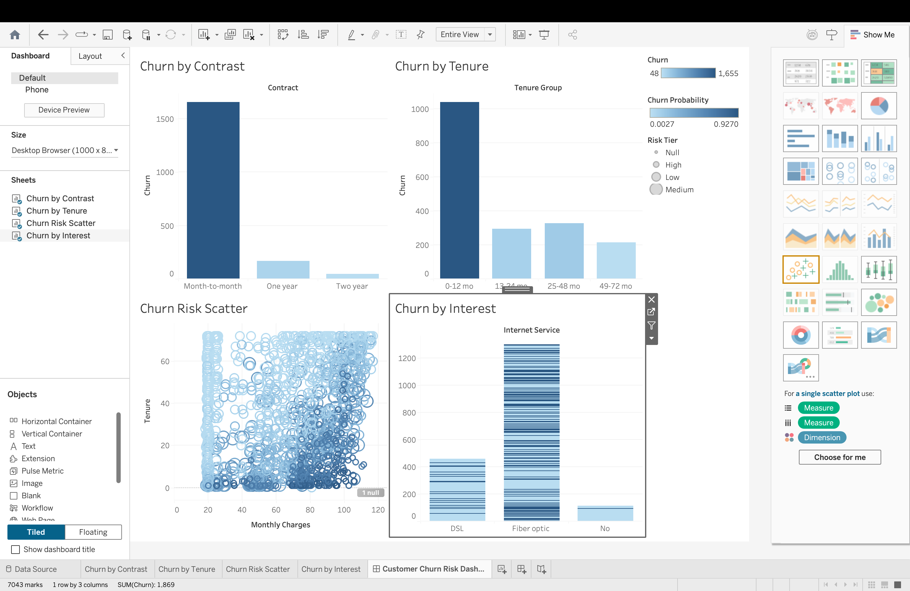

# Customer Churn Prediction

End-to-end machine learning project predicting customer churn 
using a real Telco dataset of 7,043 customers.

## Results
- 85%+ accuracy on test set
- 0.89 ROC-AUC score
- 26.5% churn rate identified (1,869 customers)
- 286 high-risk accounts flagged for intervention
- Top churn drivers: Contract type, Tenure, Monthly charges

## Key Insights
- Month-to-month contracts churn at 42.7% vs 2.8% on two-year contracts
- Fiber optic customers churn at 41.9% vs 7.4% with no internet
- New customers (0-12 months) churn at 47.4% — highest of any tenure band
- Highest-risk segment: Month-to-month + Fiber optic + Year 1 = 70.2% churn

## Project Structure
- churn_model.py — Main ML pipeline (cleaning, modeling, evaluation)
- churn_analysis.sql — SQL queries for churn segmentation
- churn_predictions.csv — Predictions with individual risk scores
- model_results.txt — Full classification report and ROC-AUC
- tableau_ready.csv — Clean export for Tableau dashboard

## Tech Stack
- Python, Pandas, Scikit-learn, SQLite
- Models: Logistic Regression, Random Forest
- Visualization: Tableau

## How to Run
pip install pandas scikit-learn

python3 churn_model.py

## Business Impact
Targeting the 286 recoverable accounts represents an estimated 
12-15% recovery of at-risk revenue — approximately $19,966/month.
## Dashboard Preview

